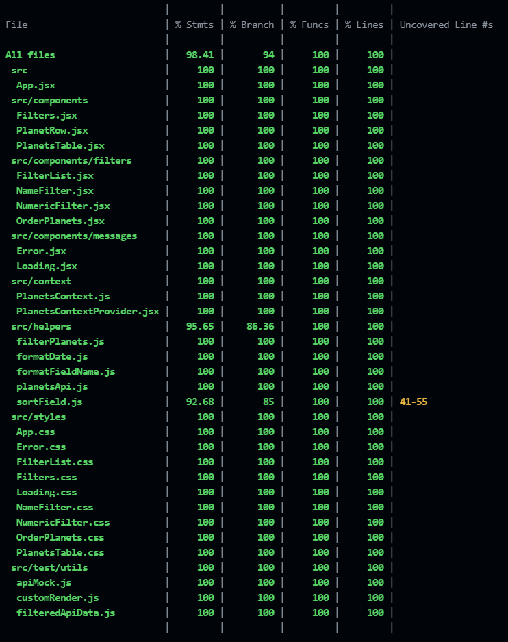

#  Star Wars Database

#### Boas vindas ao projeto Star Wars Database!

##  O QUE FOI DESENVOLVIDO

O Star Wars Database é uma lista de planetas do universo de StarWars. Nela você pode usar os filtros disponíveis para uma busca mais assertiva ou mesmo para descobrir curiosidades sobre os planetas.

Confira o site funcionando aqui -> https://star-wars-planets.vercel.app/ 

### Tecnologias utilizadas
- React (Context API + Hooks)
- Jest e RTL (para os testes)
 
 
## Comandos disponíveis

No diretório raiz do projeto, você pode rodar:

### `npm start`
Começa a rodar o app localmente, na porta 3000 (padrão), e abre uma nova guia no seu navegador, no endereço [http://localhost:3000](http://localhost:3000) para poder acessar e navegar livremente.

### `npm test`
Roda todos os testes desenvolvidos para a aplicação, os resultados são exibidos no seu terminal.

Você pode conferir mais informações sobre como rodar testes [aqui](https://facebook.github.io/create-react-app/docs/running-tests)

### `npm run test-coverage`
Roda todos os testes e mostra a cobertura de código (linhas e regras de negócio afetadas pelos testes).

Você vai se deparar com uma "tela" similar a esta:

## Observações

### As funcionalidades e objetivos iniciais propostos pela Trybe podem ser vistos no [Readme](https://github.com/diego-rib/frontend-test/blob/main/README.old.md) disponibilizado.
